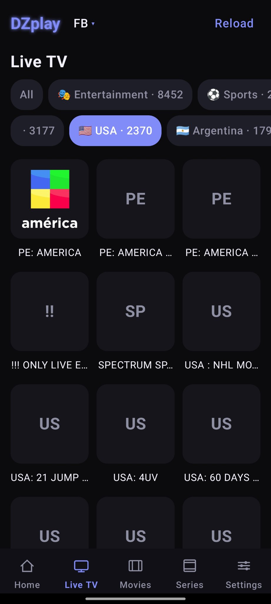
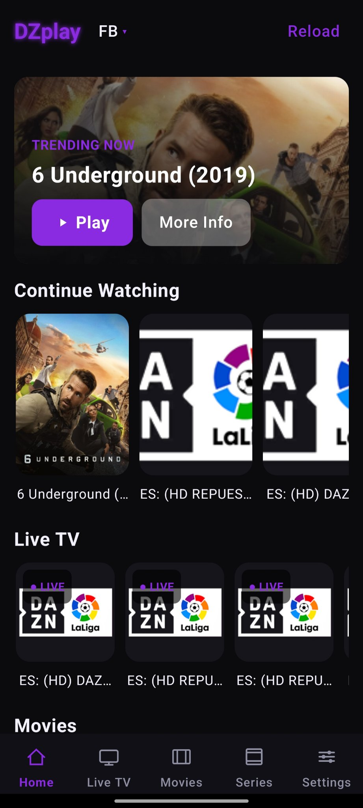
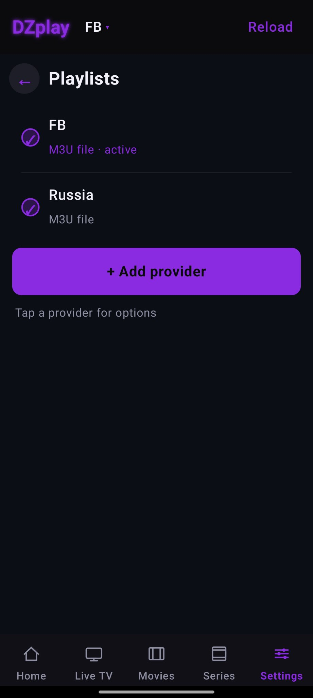

# DZplay

A premium dark OTT-style **IPTV player for Android** — built for **your own playlists**.
No accounts, no tracking, no noise. Just your channels, movies and series in a slick neon interface.



## ✨ Highlights

**📺 Live TV, Movies & Series**
- Smart category chips with counts, plus per-country filter rows for Live TV
- **Grid / List view toggle** — your choice is remembered
- Adult content stays fully separate: its own 🔞 chip, never mixed into "All"
- Home hides adult content everywhere — hero, Continue Watching, rows

**🎛️ Provider management, OTT-style**
- Slim provider rows — tap one for the full action menu:
  Edit · Properties · Rename · Set as active · Reload data · Disable/Enable · Delete
- Edit credentials per provider type: Xtream (server/user/pass), Stalker portal/MAC, M3U URL or file
- Properties view: type, server/user (password masked), expiry, cached channel counts, cache age
- Disabled providers are dimmed and excluded from every switcher and the dashboard
- One-tap provider switching from the top bar

**🎨 Themeable**
- **Live accent switching** — Neon Purple, Neon Cyan, **Violet Frost** — the whole app re-themes instantly, no restart
- Premium near-black theme with a glowing Violet Frost launcher icon

**▶️ Player**
- Blinking red ● LIVE indicator, auto SD / HD / Full HD / 4K quality badge
- Edge-swipe brightness & volume, EPG guide, 2×2 multiview, recording, catch-up, PiP, mini-player
- Channel drawer with category + country chips, provider switcher, ◎ Now button

**📱 + 📺 One app, two faces**
- Mobile bottom navigation
- Android TV / TV Box Leanback sidebar with full D-pad focus support




## 🔨 Build

No Gradle, no Android Studio needed — the manual pipeline builds the APK directly:

```bash
# 1. fetch the Compose dependencies (~90 MB, once)
python3 dl.py

# 2. build (needs: JDK 17, kotlinc, Android SDK build-tools 34)
bash build.sh
# → DZplay-<version>.apk
```

`build.sh` compiles Kotlin + Java, dexes with d8, links resources with aapt2,
aligns with `zipalign -p` and signs with the debug key.

> The APK is signed with a debug key. Install it directly on your phone or TV box.

## 📄 Notes

- Bring your own playlists: Xtream Codes, Stalker portals, M3U URLs or M3U files.
- Playlists are cached on-device for fast browsing; reload anytime per provider.
- Built with Jetpack Compose, Media3 ExoPlayer, and Kotlin.

Made by **ZyneLabs**.
